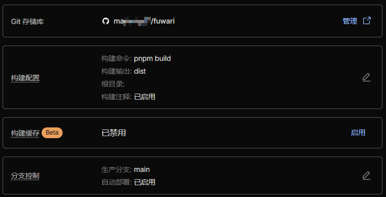

### 你需要准备的东西

1. 一个牛逼的脑子，支持并能运算至少两个单位以上的事件，会和 ai 调情

2. <a href="https://git-scm.com/downloads" target="_blank" rel="noopener noreferrer">Git</a>：最牛逼的版本控制器

3. <a href="https://nodejs.org/en" target="_blank" rel="noopener noreferrer">Node.js</a>：伟大无需多言

4. 一个 <a href="https://github.com/" target="_blank" rel="noopener noreferrer">Github</a> 账号：用于创建一个代码仓库存放 Fuwari 文件

5. 一个 <a href="https://cloudflare.com" target="_blank" rel="noopener noreferrer">Cloudflare</a> 账号：用作托管

6. <a href="https://obsidian.md/" target="_blank" rel="noopener noreferrer">Obsidian</a>：一个 md 编辑器

### 流程图

本地部署 Fuwari，编写文章 -> 推送更改到远程 Github 仓库 -> Cloudflare Pages 检测到仓库更新自动构建新的网站静态文件 -> 网站成功更改

### 让我们开搞吧！

#### 1.1 本地部署Fuwari

1. Fork 仓库：<a href="https://github.com/saicaca/fuwari" target="_blank" rel="noopener noreferrer">Fuwari 仓库</a>（如果登不上去就挂梯子）

2. 然后将仓库克隆到本地：`git clone <你的仓库URL>`（必须使用 SSH，否则不能实时推送至 cf）

3. 来到你刚克隆的项目的根目录，全局安装 pnpm：`npm install -g pnpm`（如果拉取过慢，可尝试 **npmmirror** 镜像站）

4. 在项目根目录继续安装依赖：`pnpm install` 和 `pnpm add sharp`

至此，你成功在本地部署了Fuwari

#### 1.2 本地编写文章

> 强烈推荐 obsidian 编辑器

1. 首先，在项目根目录执行：`pnpm new-post <你的文章标题>`

2. 然后，检查根目录下的 `src/content/posts` 文件夹中是否多出一个 `xxx.md` 文件

3. 我们使用 Obsidian 打开这个文件，你可以看到一些基本信息，我们只需要关注几个重要的信息：

```
title: xxx
published: xxx
description: ''
image: ''
tags: []
categories: ''
draft: false
lang: ''
```

- title：标题
- published：发布时间
- description：文章描述，正常会显示在文章标题下面
- image：文章封面图
- tag：文章标签
- categories：文章分类

4. 编写好你的文章

5. 更改根目录下的 `astro.config.mjs`，在第34行更改 `site:` 为你的站点URL

至此，你已经会用 Obsidian 编写 MarkDown 语法的博客了

#### 2.1 发布到 Github 上

1. 先来预览一下我们的博客：到项目根目录执行 `pnpm dev`，在浏览器中打开输出的链接

2. 接下来我们需要使用 Git 将我们所做的更改发布到 Github

- 首先，你需要让 Git 知道你是谁：`git config --global user.name <你的Github用户名>` 和 `git config --global user.email <你的Github邮箱>`
- 然后，更改远程仓库为 ssh*（如果是通过 ssh 克隆的不用改）：`git remote set-url origin git@github.com:xxx/xxx`
- 随后，让我们提交所有文件：`git add .`
- 之后，让我们发布一个本地提交：`git commit -m "项目初始化"`
- 最后，让我们将本地更改提交到远程仓库：`git push`

3. 此时，你的 Github 仓库应该已经有了新的提交

#### 2.2 让 Cloudflare 连接上 Github，使用 Pages 服务展示你的博客

1. 前往 Cloudflare 的 "**Workers 和 Pages**" 页面，创建一个新 "Pages"

2. 然后选择连接 Git 存储库，连接你的 Github，随后设置构建命令 `pnpm build`，然后设置构建输出目录：`dist`，如图：



1. 绑定自定义域，访问自定义域即可访问你的博客！（买域名的话推荐**雨云**或者**阿里云**）

2. 最后，你只需要在本地编写文章，然后使用 Git 将更改推送到远程仓库，Cloudflare 就会自动部署，更新你的博客啦！